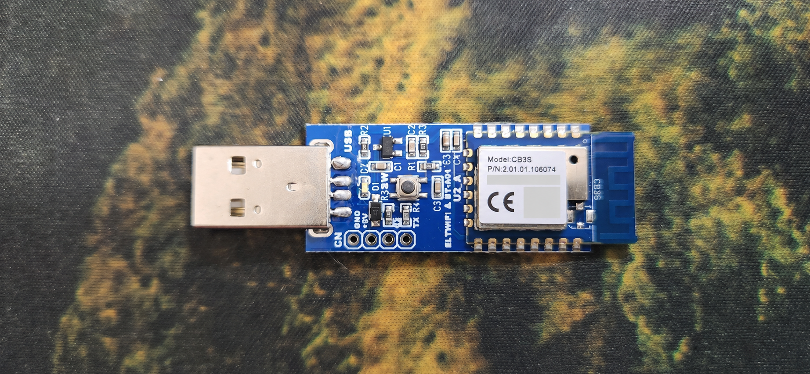
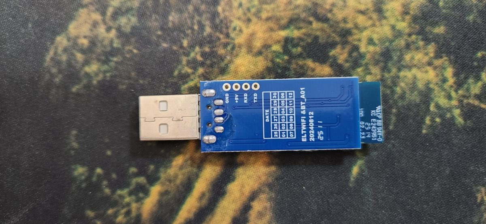
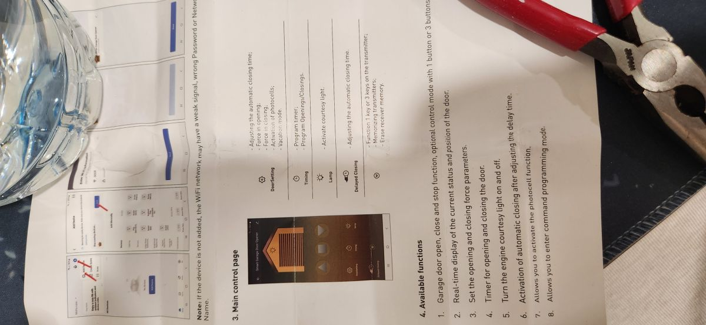

# ESPHome Tuya/Beken Garage Native

**العربية** | [English](README.md)

**تحكم مباشر بلوحة الكراج عبر وحدة Tuya CB3S الأصلية—من دون إضافة Relay خارجي.**

هذا المشروع بديل ESPHome للبرنامج الأصلي المبني على Tuya في وحدة Wi‑Fi خاصة بمشغّل باب كراج من طرازات Eazylift المشابهة. شريحة CB3S بمعالج BK7231N تتعامل مباشرة مع لوحة المحرك عبر ناقل Modbus RTU الداخلي. المشروع لا يحاكي زر الحائط بريليه خارجي، ولا يستخدم بروتوكول TuyaMCU المعتاد ذي الترويسة `55 AA`.

```text
Home Assistant ⇄ ESPHome على CB3S الأصلية ⇄ Modbus RTU ⇄ لوحة محرك الكراج
```

استُخرج البروتوكول وتعريف الأرجل من البرنامج الأصلي، ثم طُوبقت الأوامر مع التقاط حي لخط UART. يوفر الملف تحكماً محلياً من Home Assistant وصفحة ويب اختيارية من دون Tuya Cloud.

## المزايا

- أوامر فتح وتوقف وإغلاق مستقلة
- كيان Cover لباب الكراج في Home Assistant
- نسبة الفتح الحقيقية من المحرك: `0` مغلق و`100` مفتوح
- حالات فتح وإغلاق وحركة وتوقف جزئي
- التحكم بلمبة المحرك مع قراءة حالتها الحقيقية
- قوة الفتح وقوة الإغلاق
- مؤقت الإغلاق التلقائي
- إعدادا تأخير الإغلاق وتأخير إطفاء اللمبة بالقيمة الخام
- إعداد الحساس الكهروضوئي ووضع الإجازة
- تعلّم الريموت وحذف جميع الريموتات بحماية من خطوتين
- تشخيص Wi‑Fi والذاكرة وLoop Time والحرارة ومدة التشغيل وسبب إعادة التشغيل
- صفحة ويب ونقطة وصول للإنقاذ وحماية خاصة أثناء OTA

لا يوجد أمر مؤكد يجعل الباب ينتقل مباشرة إلى نسبة مطلوبة مثل 37%. لذلك تبقى النسبة للقراءة فقط، ولا يحتوي الـCover على منزلق موضع وهمي.

## العتاد والاتصال

| العنصر | القيمة |
|---|---|
| الوحدة | Tuya CB3S / BK7231N |
| لوحة ESPHome | `cb3s` |
| بروتوكول المحرك | Modbus RTU، والوحدة هي Client/Master |
| UART | سرعة `9600`، ثمانية بتات، تكافؤ فردي، بت توقف واحد (`8O1`) |
| عنوان المحرك | `0x01` |
| RX | `P10` |
| TX | `P11` |
| تمكين مرسل الخط | `P7` عبر `flow_control_pin` |
| لمبة الحالة | `P26`، معكوسة |
| زر الوحدة | `P14`، معكوس |

القابس الذي يشبه USB-A **ليس USB عادياً للبيانات**. يستخدمه المشغّل بتوصيل خاص يحمل `+5V` و`GND` و`RXD` و`TXD`. لا تفترض أنه آمن أو متوافق مع منفذ USB عادي في الكمبيوتر.

الرجل `P7` لا تخرج في القابس؛ البرنامج الأصلي يفعّلها أثناء إرسال UART، ولذلك تعمل غالباً كتمكين لدائرة قيادة TX الموجودة على لوحة المحوّل.

## صور العتاد

| واجهة المحوّل | ظهر المحوّل |
|---|---|
|  |  |



## التركيب

1. احتفظ بنسخة احتياطية من الفلاش الأصلي قبل استبداله.
2. انسخ [`esphome/cb3s-garage-door.yaml`](esphome/cb3s-garage-door.yaml) إلى مجلد ESPHome.
3. ضع بيانات Wi‑Fi في `secrets.yaml`؛ استخدم [`esphome/secrets.example.yaml`](esphome/secrets.example.yaml) مثالاً.
4. افحص الملف وابنه عبر ESPHome.
5. في أول مرة، فلّش CB3S مباشرة عبر UART الخاص بالبرمجة.
6. أعد الوحدة إلى الكراج واختبر والباب خالٍ من العوائق، مع وجود شخص بجانب زر الإيقاف الحقيقي.
7. تأكد أن `Opening Position` يساوي `0%` عند الإغلاق الكامل و`100%` عند الفتح الكامل قبل إنشاء أي Automation.

تم التحقق من الملف باستخدام ESPHome 2026.8.1. إعداد Home Assistant API محلي ومن دون تشفير، كما هو مطلوب لهذا التركيب. يمكنك إضافة التشفير إذا كانت سياسة شبكتك تتطلبه.

## OTA والاستعادة

اتصال الوحدة بلوحة الكراج كان يجعل إعادة التشغيل الدافئة بعد OTA غير مستقرة. لذلك الملف الحالي:

- يوقف Modbus أثناء بدء Wi‑Fi؛
- يوقف Modbus ويفرغ طابور الإرسال قبل OTA أو إعادة التشغيل؛
- يعيد القراءة من المحرك بعد اتصال Wi‑Fi بخمس ثوانٍ؛
- يعطل إعادة التشغيل التلقائية بسبب مهلة Wi‑Fi أو API؛
- يوفر نقطة وصول احتياطية وحساسات تشخيص.

لا تحذف أقسام `on_boot` أو`on_shutdown` أو معالجات Wi‑Fi أو حماية OTA إلا إذا كنت تفهم وظيفة دائرة UART في هذه اللوحة.

## الريموتات

القيمة `0x2005 = 1` تبدأ تعلّم ريموت RF، والقيمة `0x2005 = 2` تحذف الريموتات المخزنة. الأمر لا يحمل رقم ريموت، ولذلك يُعامل كأمر **حذف جميع الريموتات**. زر الحذف معطل افتراضياً ولا يعمل إلا بعد تفعيل مفتاح التسليح لمدة 15 ثانية.

خيار `Three-Button Remote Control` في السجل `0x400B` يعتمد على إصدار المحرك والريموت. في الريموت ذي الأربعة أزرار الذي جرى اختباره، كان الخيار يعود للإيقاف بعد نحو 17 ثانية أو بعد اكتمال حركة، وبقي كل زر متعلّم يعمل منفرداً بتتابع فتح/توقف/إغلاق. لا تفترض دعم ثلاثة أزرار مستقلة قبل اختبار إصدارك الفعلي.

## التوثيق وأدوات التحليل

- [مرجع البروتوكول بالعربية](docs/protocol-ar.md)
- [Protocol reference in English](docs/protocol.md)
- [`tools/analyze_bk_dump.py`](tools/analyze_bk_dump.py): فحص بنية الفلاش وEntropy والنصوص وأجزاء JSON
- [`tools/reverse_uart.py`](tools/reverse_uart.py): تعقب نصوص المنتج والمؤشرات والكود القريب
- [`tools/disasm_thumb.py`](tools/disasm_thumb.py): تفكيك Thumb مع التعليقات
- [`tools/find_thumb_xrefs.py`](tools/find_thumb_xrefs.py): البحث عن مراجع العناوين والفروع

ملف الـdump والأقسام المفكوكة وملفات تخزين Tuya ومعرفات الجهاز والمفاتيح وبرنامج الشركة الأصلي **غير موجودة عمداً** في هذا المستودع العام. تسمح البصمة المذكورة في توثيق البروتوكول لمالك الجهاز بمقارنة نسخته التي حصل عليها بنفسه من دون توزيع Firmware الشركة.

## السلامة

باب الكراج آلة ثقيلة متحركة. أبقِ محددات المشوار وحساس العوائق والحساس الكهروضوئي الأصلي فعالة. Home Assistant وWi‑Fi وهذا البرنامج وأمر `Stop` ليست بديلاً لمعدات السلامة المعتمدة. اختبر دائماً ومسار الباب خالٍ.

## الترخيص

الكود والتوثيق المكتوبان للمشروع متاحان وفق [رخصة MIT](LICENSE). البرنامج الأصلي والعلامات التجارية ملك لأصحابها ولا يجري توزيعهما هنا.
